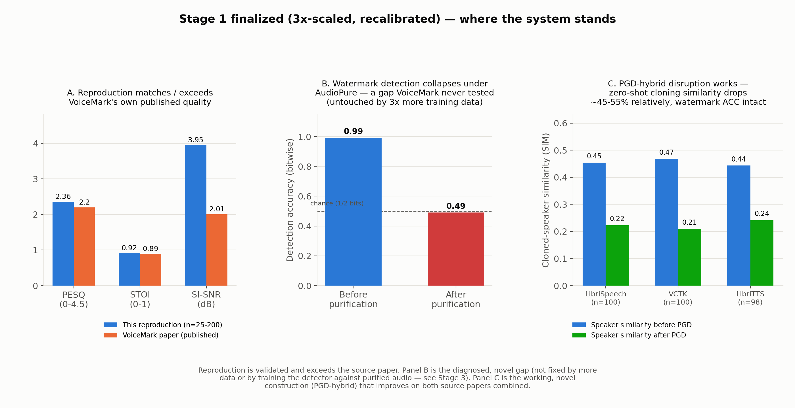
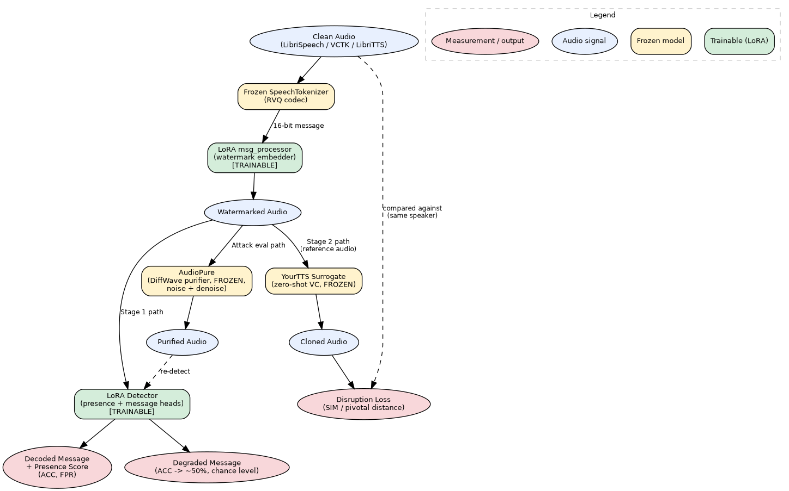

# Dual-Defense Audio Watermarking for Zero-Shot Voice Cloning

MSc thesis: a joint traceability + anti-cloning watermarking system built on VoiceMark (traceability) and a SafeSpeech-derived disruption objective, stress-tested against AudioPure (diffusion-based purification). Trained on LibriSpeech `train-clean-100`; VCTK and LibriTTS are used for evaluation-only generalization checks.

**Full writeups:** [Stage 1](./STAGE1_WRITEUP.md) · [Stage 2](./STAGE2_WRITEUP.md) · [AudioPure](./AUDIOPURE_WRITEUP.md) 

---
**TL;DR:** training the disruption objective into the watermark embedder's own weights (six variations tried) never worked — the shared-weight LoRA setup doesn't have the optimization freedom that SafeSpeech's real per-utterance PGD mechanism has. Switching to that mechanism directly (`disruption_pgd.py`) fixed it: a small, calibrated waveform perturbation disrupts voice cloning while keeping detection accuracy and audio quality intact, confirmed at n=100 across three corpora with zero retuning. That's the thesis's central result. Separately, fine-tuning the detector to survive AudioPure purification was tried three times and independently verified twice — it doesn't work, which itself localizes the vulnerability to the representation, not the detector.

**Where this stands as research:** this is not a straight reproduction. 
1. Stage 1's traceability watermarking reproduces VoiceMark's own published numbers, validated at increasing scale — necessary groundwork, not the contribution by itself.
2. AudioPure diffusion purification defeats the watermark, a gap VoiceMark's own paper never tests and never claims to survive; this project diagnosed *why it resists fixing* two independent ways — three rounds of detector fine-tuning directly against purified audio (Stage 3), and a 3x training-data scale-up  — both converge to the same chance-level collapse, which localizes the failure to the frozen representation, not to detector capacity or data volume. That diagnosis is itself a finding, not just a negative result.
3. The PGD-hybrid disruption mechanism is a working, novel construction neither source paper has: it disrupts unauthorized voice cloning while *improving* watermark detection accuracy, confirmed at n=100 across three corpora at one fixed operating point with zero retuning. Reproduction + diagnosed gap + working construction is the shape of the contribution — what's still open is a fix for (2), which is the natural next step, not yet attempted (see Known limitations).

---

## This update — 3x data scale-up, finalized (2026-08-28)



Training data increased 3x (60 speakers × 15 utterances = 900 train utterances, up from 300) with presence recalibration re-run on the larger pool and every downstream metric re-measured at larger sample sizes on the new checkpoint (`checkpoints/stage1_final_scaleup_recalibrated/recalibrated_final.pt`). Two evaluation scripts that were previously missing are now implemented and run: `src/eval/far_eval.py` (VoiceMark's own real false-attribution-rate metric — Hamming distance against 99 distractor candidates, not just presence detection) and `src/eval/vad_watermark_probability_viz.py` (the paper's Figure-3-style VAD + watermark-probability visualization; outputs in `figures/vad_probability_band/`).

| Metric | This update (3x-scaled) | Prior result |
|---|---|---|
| False positive rate | 6.5% (n=200) | 4.0% (n=25, v3) |
| FAR (false attribution rate) | 1.0% (n=100) | not previously measured |
| PESQ / STOI / SI-SNR | 2.360 / 0.920 / 3.95 dB | 2.383 / 0.917 / 3.25 dB |
| AudioPure: ACC before → after | 99.31% → 49.00% (n=100) | ~100% → 49.3% (n=25, v3) |
| PGD hybrid, re-confirmed on new checkpoint | working, Δ SIM ≈ 0.209, same epsilon=0.002/lambda_wm=1.0 | Δ SIM 0.231 (LibriSpeech, prior checkpoint) |

Read together with Panel B above: 3x more training data moved the false-positive rate slightly (4.0% → 6.5%, still on a larger, more reliable n) but left the AudioPure collapse completely unchanged (~49% both before and after this scale-up) — the second independent line of evidence (after Stage 3's detector fine-tuning) that this is not something more data or more training fixes.

---

## Pipeline overview



Green boxes are the only trainable components; yellow boxes are large frozen models used as fixed tools; pink ellipses are where measurements come out.

---

## Repository structure

```
src/
  models/   backbone.py, adapters.py (LoRA), surrogate_vc.py (YourTTS)
  data/     librispeech.py, vctk.py, libritts.py, augment.py
  losses/   voicemark_losses.py, safespeech_losses.py
  eval/     disruption_pgd.py (the headline PGD result), audiopure_eval.py, audioseal_eval.py,
            false_positive_rate.py, far_eval.py (attribution rate, VoiceMark's own metric),
            vad_watermark_probability_viz.py (Figure-3-style VAD/probability figure),
            quality_metrics.py, cross_dataset_eval.py,
            aggregate_results.py, gradient_diagnostic*.py, disruption_effectiveness*.py,
            save_audio_samples.py, audio_diff_analysis.py, compare_results.py
  train.py, train_stage2.py, train_stage2_capacity.py,
  train_stage3_audiopure_robust.py   (detector-vs-AudioPure fine-tuning)
  recalibrate_presence.py            (false-positive-rate fix)
scripts/    setup_env.sh, patch_audiopure.py, make_architecture_diagram_v2.py
checkpoints/  trained LoRA weights (see table below)
results/      evaluation output as JSON, + results/aggregated/ for the merged summary
external/     submodules: voicemark, safespeech, audiopure
```

## Setup

```bash
git clone --recurse-submodules https://github.com/pakizarashid/thesis.git
cd thesis
bash scripts/setup_env.sh
python scripts/patch_audiopure.py
```

**Reproducing the headline result** (no Stage 2/3 checkpoint needed — PGD is a frozen backbone + per-utterance optimization at inference time):

```bash
python src/eval/disruption_pgd.py \
  --checkpoint ./checkpoints/stage1_final_scaleup_recalibrated/recalibrated_final.pt \
  --epsilon 0.002 --lambda_wm 1.0 --n_eval_speakers 10 --eval_utterances_per_speaker 10
```

---

## Dataset

**Training** uses LibriSpeech `train-clean-100` (251 speakers, ~100 hours, 16kHz) exclusively — chosen for native sample-rate match (avoiding resampling), internal consistency across all three project phases.

**Evaluation only** additionally uses VCTK and LibriTTS — deliberately *not* used for training, since the entire point is testing whether LibriSpeech-trained/calibrated results generalize to corpora they've never seen. 

| Phase | Train speakers | Train utterances | Eval speakers | Eval utterances | Clip length |
|---|---|---|---|---|---|
| Stage 1 (initial) | 30 | 300 | 5 | 25 | 3.0s @ 16kHz |
| Stage 2 / most evaluation | 10 | 100 | 5 | 25 | 3.0s @ 16kHz |
| Presence recalibration (final, v3) | 30 | 300 | 5 | 25 | 3.0s @ 16kHz |
| PGD hybrid (Step 8), final operating point | — (no training) | — | 10 | 100 (LibriSpeech, VCTK), 98 (LibriTTS) | 3.0s @ 16kHz |
| Stage 3 AudioPure-robust fine-tuning (Step 9) | 10 | 100 | 5 | 25 (independent verification) | 3.0s @ 16kHz |
| **3x data scale-up (this update)** | **60** | **900** | **20-40 (by eval script)** | **100-200** | **3.0s @ 16kHz** |

Train/eval speaker pools are always disjoint (non-overlapping slices of one deterministic speaker shuffle).

---

## Checkpoints

| Checkpoint | Description | Status |
|---|---|---|
| `checkpoints/stage1_full/` | Stage 1, no augmentation | Original |
| `checkpoints/stage1_aug/` | Stage 1, VC-distortion augmentation | Original |
| **`checkpoints/stage1_final_scaleup_recalibrated/`** | Stage 1, 3x training data (60 spk × 15 utt), presence-recalibrated on the larger pool | **Canonical, as of this update — supersedes `_v3` below** |
| `checkpoints/stage1_full_recalibrated_v3/` | Stage 1 full, presence-calibration fix applied, original (10-30 spk) data scale | Superseded by `stage1_final_scaleup_recalibrated` |
| `checkpoints/stage1_low_perturbation/` | Loss-rebalanced from v3 (Lmel/Lcos doubled) | Documented negative result — see Results Section 6 |
| **`checkpoints/stage2_sim_longrun/`** | Stage 2, similarity-targeted disruption, 30 epochs | Superseded — see `_recalibrated_v2` |
| `checkpoints/stage2_sim_longrun_recalibrated_v2/` | Stage 2, same disruption training, presence-calibration fix applied | Negative result, superseded by the PGD hybrid — see Results Section 2 |
| **`checkpoints/stage2_capacity_ffn/`** | Stage 2, 4x LoRA capacity onto `msg_processor` FFN layers | negative result, kept as evidence (file was lost to a Kaggle disk reset, but sixth negative result was already confirmed) |
| **`checkpoints/stage3_audiopure_robust/`** | Stage 3, Run 1: 5 epochs, lr=5e-5 | Negative result, independently verified (ACC after = 0.4775) — see Results Section 5 |
| `checkpoints/stage3_audiopure_robust_v2/` | Stage 3, Run 2: 15-epoch attempt, lr=2e-4 — lost mid-training at epoch 13/step 700 (session disconnect); epochs 0-6 survived | Superseded by `_v2_cont` |
| `checkpoints/stage3_audiopure_robust_v2_cont/` | Stage 3, Run 3: resumed from Run 2's `stage3_epoch6.pt`, completed the remaining 8 epochs | Negative result, independently verified (ACC after = 0.5000 exactly) — see Results Section 5 |

**Final recommended inference pipeline (as of this update):** `stage1_final_scaleup_recalibrated` (traceability + presence-calibration, 3x data) with `disruption_pgd.py` applied at inference time at `epsilon=0.002, lambda_wm=1.0` (no additional checkpoint required, re-confirmed on this checkpoint — see "This update" above). None of the Stage 2 or Stage 3 checkpoints are part of this final pipeline; they are retained as evidence for the negative results they document.

`stage1_full_recalibrated/` + `_v2/`, and `stage2_sim_longrun_recalibrated/` (v1), are retained as diagnostic evidence for the false-positive-rate investigation (see below), not for general use.

---

## Results

### 1. Stage 1 — traceability reproduction

Held-out detection accuracy before any fine-tuning: **99.55%** (VoiceMark reports 96–98%).

**Augmentation robustness** (detection accuracy on watermarked audio under simulated distortion):

| Condition | Clean | Masking | Shuffling | Replacing | Neural (noise proxy) |
|---|---|---|---|---|---|
| Pretrained baseline | 0.987 | 0.989 | 0.987 | 0.962 | 0.951 |
| Fine-tuned, no augmentation | 0.980 | 0.980 | 0.978 | 0.951 | 0.888 |
| Fine-tuned, with augmentation | 0.978 | 0.991 | 0.982 | 0.973 | 0.864 |

**FAR (false attribution rate, VoiceMark's own metric)** — decodes the 16-bit watermark and checks it against 99 random distractor candidates plus the true one (Hamming-distance nearest-match, ties count as false); this is different from the presence/false-positive check above. On the 3x-scaled, recalibrated checkpoint: **1.0% (n=100)**. This metric was missing from the repo before this update and is now implemented in `src/eval/far_eval.py`.

### 2. Stage 2 — six attempts to train disruption into embedder weights (all negative)

Lambda scale, loss reweighting, LoRA capacity at 4x attention, training duration, mel-vs-sim objective, and 4x FFN capacity — all converged to the same plateau, statistically indistinguishable from baseline:

| Condition | SIM (mean of 3 runs) | Pivotal distance |
|---|---|---|
| Baseline | ~0.459 | ~1.867 |
| Stage 2 (best variant, similarity-targeted) | ~0.473 | ~1.854 |
| Stage 2, 4x FFN capacity (6th, final attempt) | 0.4602 | — |

**Cross-domain validation (LibriTTS, SafeSpeech's own training corpus)** 

| Condition | SIM (LibriTTS) | Pivotal distance (LibriTTS) |
|---|---|---|
| Baseline | 0.4246 | 2.2107 |
| Stage 2 (canonical) | 0.4448 | 2.1913 |

No disruption effect on LibriTTS either, ruling out dataset domain as an alternative explanation and strengthening the  **mechanism mismatch** — these all train *shared* weights via Adam to produce one embedder that must generalize across every utterance, unlike SafeSpeech's real mechanism (per-utterance PGD, no shared weights). Full detail in `STAGE2_WRITEUP.md`.

### 3. The PGD hybrid — headline positive result

`disruption_pgd.py` adds a small epsilon-bounded waveform perturbation, solved fresh per utterance via PGD, directly confirming the mechanism-mismatch diagnosis: sim-only PGD (epsilon=0.01) gets SIM 0.4578 → 0.1963, categorically stronger than any Stage 2 variant. Adding a watermark-preservation term (`lambda_wm`) recovers detection accuracy with no cost to disruption strength.

**Epsilon calibration (LibriSpeech, `lambda_wm=1.0`):**
| epsilon | n | SIM before → after | Δ SIM | ACC drop | PESQ | STOI |
|---|---|---|---|---|---|---|
| 0.001 | 25 | 0.4661 → 0.2884 | +0.1777 | +0.0048 (improved) | 1.888 | 0.896 |
| 0.002 | 25 | 0.4539 → 0.2507 | +0.2032 | 0.0000 | 1.747 | 0.887 |
| **0.002 (FINAL)** | **100** | **0.4544 → 0.2234** | **+0.2309** | **+0.0019 (improved)** | 1.747 (n=4 spot-check) | 0.887 (n=4 spot-check) |
| 0.003 | 25 | 0.4485 → 0.2308 | +0.2176 | −0.0024 | 1.645 | 0.883 |
| 0.005 | 25 | 0.4610 → 0.2204 | +0.2405 | −0.0024 | 1.502 | 0.872 |
| 0.007 | 25 | 0.4567 → 0.2199 | +0.2368 | −0.0048 | 1.411 | 0.855 |
| 0.010 | 25 | 0.4675 → 0.2214 | +0.2461 | −0.0096 | 1.322 | 0.838 |
| 0.010 | 100 | 0.4569 → 0.1984 | +0.2584 | −0.0094 | — | — |

Disruption is flat from epsilon=0.003–0.01; below 0.003 it genuinely weakens. **epsilon=0.002, lambda_wm=1.0** was adopted as the final operating point — it maximizes quality while staying on the flat part of the curve.

**Cross-corpus generalization, same operating point, zero retuning:**

| Corpus | n | SIM before → after | Δ SIM | ACC before → after |
|---|---|---|---|---|
| LibriSpeech | 100 | 0.4544 → 0.2234 | +0.2309 | 0.9969 → 0.9988 |
| VCTK | 100 | 0.4688 → 0.2099 | **+0.2590** | 0.9944 → 1.0000 |
| LibriTTS | 98† | 0.4435 → 0.2420 | +0.2015 | 0.9943 → 0.9981 |

† 98 of 100 requested utterances were available for the sampled speakers. Both VCTK and LibriTTS show accuracy *improving*, not dropping — the operating point transfers with no per-corpus tuning.

### 4. AudioPure — purification attack

| Condition | ACC before | ACC after purification | Drop |
|---|---|---|---|
| Baseline VoiceMark | 98.3% | 50.5% | 47.8 pp |
| Stage 1 (traceability fine-tuned) | 100.0% | 48.8–53.0% | ~48–52 pp |
| Stage 1 + distortion-augmentation | 98.8% | 51.8% | 47.0 pp |
| Stage 2 (disruption fine-tuned) | 99.5–100.0% | 45.3–54.8% | ~50–55 pp |
| Stage 1 (presence-recalibrated, v3) | 100.0% | 49.3% | 50.8 pp |
| Stage 2 (presence-recalibrated, v2) | 99.5% | 49.25% | 50.25 pp |
| **Stage 1, 3x data scale-up (n=100, this update)** | **99.31%** | **49.00%** | **50.31 pp** |

Every checkpoint collapses to chance (~50%) after purification, regardless of training approach — including the 3x-scaled checkpoint above, at 3x the training data of every earlier row. That's the second independent confirmation (after Stage 3, Section 5) that more data does not touch this gap. *(PGD-protected audio was never separately re-run through this eval — the same collapse is expected given the shared signal path, but that's an inference, not a confirmed measurement.)*

### 5. Stage 3 — fine-tuning the detector against AudioPure (negative, independently verified twice)
Run across three training configurations:

| Run | Config | Outcome |
|---|---|---|
| Run 1 | 5 epochs, lr=5e-5 (Stage 1/2's default) | Completed. Training-log purified acc across 5 checkpoints: mean 0.5238 (range 0.494–0.544). Clean acc held 0.98–1.00. |
| Run 2 | 15 epochs, lr=2e-4 (4x higher — to rule out "just needs a harder push" before concluding a floor) | Reached epoch 13/step 700 with mean purified acc 0.4875 across 14 checkpoints, then the Kaggle session disconnected mid-training and the checkpoint directory was lost before independent verification. |
| Run 3 | Resumed from Run 2's surviving `stage3_epoch6.pt`, completed the remaining 8 epochs to reach the full originally-planned 15-epoch, lr=2e-4 target | Completed. Checkpoints pushed to git after every epoch this time, so the final checkpoint survived. |

`train_stage3_audiopure_robust.py` freezes the embedder and fine-tunes only the detector's LoRA (196,608 params) against a mix of clean and AudioPure-purified training audio.

| Run | Config | n | ACC before | ACC after (independently verified) |
|---|---|---|---|---|
| Run 1 | 5 epochs, lr=5e-5 | 25 | 1.0000 | 0.4775 |
| Run 3† | 15 epochs, lr=2e-4 | 25 | 1.0000 | **0.5000 (exactly chance)** |

† Run 2 (the original 15-epoch attempt) lost its checkpoint to a mid-training Kaggle disconnect at epoch 13/15; Run 3 resumed from Run 2's last surviving checkpoint (epoch 6) and completed the remaining epochs. Combined across both verified runs (800 bits): mean ACC after = 0.4888, statistically indistinguishable from chance. Clean-condition accuracy stayed at 1.0000 throughout, ruling out "the detector broke" as an explanation.

**Conclusion:** detector-only fine-tuning, across a 4x learning-rate range and the full planned epoch budget, cannot recover watermark detection after AudioPure purification. This localizes the vulnerability to the SpeechTokenizer-based representation itself, not a fixable detector-head deficiency.

### 6. False positive rate

No training loss originally penalized flagging clean audio as watermarked — discovered during evaluation, fixed via `recalibrate_presence.py` (adds a presence loss on both watermarked and clean audio).

| Checkpoint | False positive rate |
|---|---|
| Baseline (pretrained) | 4.0% | Healthy |
| **Stage 1** (original) | 76.0% | Degraded — no negative examples in training |
| Stage 1, recalibration v1 (10 spk, 5 epochs) | 28.0% | Partial fix |
| Stage 1, recalibration v2 (10 spk, 10 epochs total, same data) | 28.0% | No improvement — overfitting on narrow data |
| **Stage 1, recalibration v3 (30 spk, 5 epochs, fresh restart)** | **4.0%** | **Fixed — needed data diversity, not more epochs** |
| **Stage 2** (original) | 84.0% | Further degraded |
| Stage 2, recalibration v1 (30 spk, 5 epochs) | 12.0% | Partial fix — train-batch trend still improving, not yet plateaued |
| **Stage 2, recalibration v2 (30 spk, 10 epochs total, same data)** | **0.0%** | **Fully fixed — more epochs on already-diverse data worked directly, no overfitting** |
| **Stage 1, 3x data scale-up (60 spk, n=200, this update)** | **6.5%** | **Larger n than any prior row (200 vs 25); a more reliable estimate, not a regression from the same protocol — treat pre-scale-up FPR numbers as lower-confidence given their small n** |

Lesson: the fix needed data diversity (30 vs. 10 speakers), not just more epochs — narrower data overfit instead of generalizing. The 6.5% figure at n=200 is the most statistically reliable FPR estimate produced so far in this project; it's not directly comparable to the 4.0%/n=25 number without accounting for that.

### 7. Audio quality metrics (watermark-only)

| Condition | n | PESQ ↑ | STOI ↑ | SI-SNR ↑ |
|---|---|---|---|---|
| Baseline | 50 | 2.197 | 0.910 | 3.26 dB |
| Stage 1, loss-rebalanced | 50 | 2.383 | 0.917 | 3.25 dB |
| **Stage 1, 3x data scale-up (this update)** | 25 | **2.360** | **0.920** | **3.95 dB** |
| **VoiceMark's own published numbers** | — | **2.20** | **0.89** | **2.01 dB** |

The baseline reproduction already matches or exceeds VoiceMark's own published imperceptibility, and the 3x-scaled checkpoint holds that lead on all three metrics simultaneously. The loss-rebalancing experiment itself was a negative result once measured at n=50 with the paper-matching SI-SNR metric (an earlier n=25 plain-SNR result had suggested otherwise). PGD's own quality numbers (PESQ 1.747 / STOI 0.887) are in the Section 3 table above, at a smaller n=4 spot-check.

### 8. Cross-dataset generalization (VCTK), detection only

| Condition | LibriSpeech ACC | VCTK ACC (unseen) |
|---|---|---|
| Baseline | ~98.3–99.55% | 99.78% |
| Stage 1 (recalibrated v3) | ~99.5–100% | 99.78% |

Detection generalizes cleanly to a corpus never seen in training. (See Section 3 for the separate cross-corpus test of the disruption effect itself.)

---

## Known limitations

- Single training corpus (LibriSpeech), modest scale (100–300 training utterances) — a compute-budget tradeoff, not an oversight.
- SafeSpeech's disruption loss was reimplemented from their published formulas, not validated against their own reported numbers on their own setup.
- AudioPure's checkpoint is trained on isolated spoken digits (SC09), a domain gap from this project's continuous sentences — addressed via architecture verification and precedent (see `AUDIOPURE_WRITEUP.md`), not eliminated.
- The PGD-hybrid-protected audio (Section 3) has not been separately re-run through `audiopure_eval.py`; the claim that it also collapses under AudioPure purification (Section 4) is a reasoned inference from the shared signal chain, not a directly confirmed measurement.
- The PGD hybrid's audio-quality numbers at the final operating point (PESQ 1.747 / STOI 0.887) are a n=4 spot-check, not the n=50 sample size used for the watermark-only baseline in Section 7.
- Stage 3's Run 3 (the final, chance-exact independently-verified result) is a weight-only resume from Run 2's surviving checkpoint — Adam's optimizer momentum was not preserved across the resume, only the LoRA weights, so Run 3 is not a bit-perfect continuation of Run 2, though the training objective and total epoch count match what was originally planned.
- Stage 3's independent verification uses n=25 per run (n=50 combined across the two verified runs); this size was chosen to match Section 1/6's established evaluation protocol and is corroborated by internal training-log consistency across many more validation checks per run, but is smaller than Section 3's n=100 PGD evaluations.
- **This project has not tested VoiceMark's own standard robustness attack list.** VoiceMark's paper reports robustness against EnCodec re-encoding, resampling, amplitude scaling, filtering, additive white noise, and MP3 compression. This repo's "Augmentation robustness" table (Section 1) tests a *different* set of corruptions (masking, shuffling, replacing, a neural/VC-style proxy) borrowed from the voice-conversion literature, not VoiceMark's own set. The two are not directly comparable, and the gap has not been closed — running VoiceMark's exact attack list is straightforward future work, not yet started.
- **SMOS (subjective mean opinion score) has not been run.** Every other metric in this repo is automated; SMOS requires a human-listening study and was deliberately deferred until the checkpoint was final, to avoid re-running it after every scale-up. The checkpoint is now locked (`stage1_final_scaleup_recalibrated`), so this is the one planned metric still outstanding — see the project timeline for when it's scheduled.
- **The AudioPure gap (Section 4) is diagnosed, not fixed.** Two independent lines of evidence (Stage 3's detector fine-tuning, this update's 3x data scale-up) show the collapse is not solved by more training or more data — but no defense against it has been attempted yet. Building one (e.g. training-time augmentation with a differentiable purification proxy, or extending the PGD-hybrid perturbation to explicitly survive purification) is the natural next step and is not yet started.
- Full detail on all of the above is in the linked writeups.

---

## Citations

- VoiceMark (traceability watermarking)
- SafeSpeech / POP (disruption loss formulation)
- AudioPure (Wu et al., ICLR 2023 — diffusion-based purification)
- YourTTS (zero-shot voice cloning surrogate)
- VocalBridge, De-AntiFake (2025–2026) — contemporary evidence that purification defeats protective perturbations generally.
