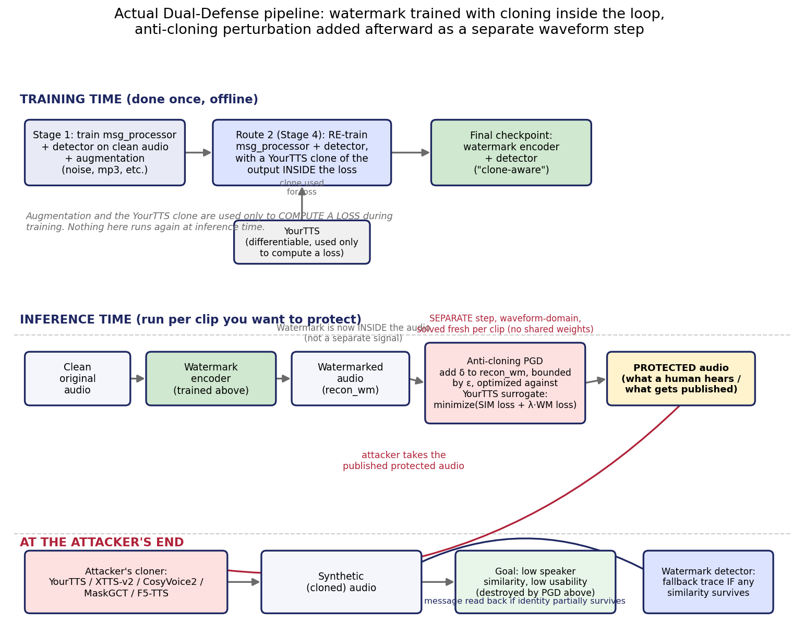

# Dual-Defense Audio Protection

**Watermarking (traceability) + adversarial perturbation (anti-cloning) against zero-shot voice cloning.**

This project combines a VoiceMark-style traceable watermark with a SafeSpeech-style
adversarial perturbation, and asks whether one system can do both jobs at once: make a voice
clone of a protected recording unconvincing, and still let the source be traced if a clone
partly works.

---

## 1. Goal and success criteria

The protected audio has three requirements, in this order of priority:

1. **Humans hear clean, good-quality audio.** The watermark and the perturbation must be
   inaudible or nearly so (PESQ, STOI, SI-SNR on the protected source).
2. **Cloning from it fails.** If an attacker feeds the protected audio to a voice-cloning
   tool, the clone should not sound like the speaker (speaker similarity SIM goes down) and
   should be of little use (attack success rate and intelligibility).
3. **Traceability as a safety net.** If some speaker similarity survives anyway, the
   watermark should still be readable from the clone (watermark ACC).

Watermark accuracy is therefore not the goal by itself. It is the fallback for the cases
where the main defense (2) did not fully work.

| Goal | Metric | Good direction |
|---|---|---|
| Clean protected source | PESQ / STOI / SI-SNR | higher |
| Destroy speaker identity in the clone | speaker similarity (SIM) | lower |
| Make the clone unusable | attack success rate (ASR, SIM > 0.25), WER | ASR lower, WER higher |
| Trace the clone to its source | watermark ACC | higher |

**How to read ACC.** ACC is per-bit accuracy over a 16-bit message, so guessing gives 0.5, not
0. An ACC of 0.69 is about 38% of the way from guessing to perfect. One clip at 11/16 bits
correct would happen by chance about 10% of the time, so a single clone is suggestive, not
proof; averages over many clips are clearly above chance.

**Name the encoder next to every SIM number.** SIM is cosine similarity between speaker
embeddings of the clean original and the clone. Here it is measured with the YourTTS speaker
encoder (training-cloner and XTTS results) or ECAPA-TDNN (SafeSpeech-comparable F5-TTS and
MaskGCT results). Numbers from different encoders are not comparable.

---

## 2. How the system works



**Training time (once, offline).**

- *Stage 1:* train LoRA adapters on VoiceMark's frozen codec so that a 16-bit message is
  embedded by `msg_processor` (summed across residual layers 2–8 of the codec) and read back
  by a detector. Augmentation (noise, MP3, masking, shuffling) is applied during training.
- *Route 2 (Stage 4):* re-train `msg_processor` and the detector with a differentiable
  YourTTS clone of the watermarked audio inside the loss: joint loss = detection on clean
  audio + detection on the clone. The augmentation and the YourTTS clone are only used to
  compute this loss; neither runs again at inference.

**Inference time (per clip to protect).**

1. Clean audio → trained watermark encoder → watermarked waveform `recon_wm`.
2. Anti-cloning PGD, a separate step on the waveform: add a bounded perturbation δ
   (|δ| ≤ ε) to `recon_wm`, solved fresh for each clip with 10 sign-gradient steps against a
   frozen, differentiable **YourTTS surrogate**. Each step minimizes
   `SIM-disruption loss (clone vs. clean speaker) + λ_wm × watermark-decoding loss on the perturbed audio`.
   `λ_wm` is what keeps the watermark readable while similarity is driven down. With
   `λ_wm = 0` the watermark collapses toward chance (ACC ≈ 0.59). The protected audio is
   `clamp(recon_wm + δ, −1, 1)`. No weights are trained or saved in this step.
3. The attacker clones the protected audio with some zero-shot tool. The watermark detector
   is the fallback check on the output.

YourTTS is the only differentiable cloner here. Every other cloner (XTTS-v2, CosyVoice 2,
MaskGCT, F5-TTS) is evaluated black-box and was never used for training.

**Why the two defenses compete.** Attribution needs speaker-related information to survive
cloning; anti-cloning needs it destroyed. Both act on the same residual layers (2–8) of the
codec. This is the central tension the project measures.

---

## 3. Results at a glance

| Question | Answer | Where |
|---|---|---|
| Does the published watermark survive every cloner? | No. ACC after cloning ranges from 0.53 (YourTTS) to 0.93 (F5-TTS), set by how much of the reference audio the cloner keeps. Checked at the latent level too. | §5.1 |
| Does the anti-cloning perturbation transfer? | Yes to XTTS-v2. Only weakly to F5-TTS at the default strength. | §5.2 |
| Can strength fix the weak transfer? | Raising ε helps but lowers watermark ACC and audio quality: a three-way trade-off with no free setting. | §5.3 |
| Does cloning-aware training (Route 2) improve traceability? | Yes, on all five cloners tested, including four never used in training, and on a new dataset (VCTK) with a new cloner. | §5.4 |
| Is the encoder retraining needed, or is detector retraining enough? | Retraining the detector alone barely helps. The larger gain needs `msg_processor` retraining too. | §5.4 |
| What does Route 2 cost? | About −0.22 to −0.28 PESQ for the encoder retraining (100 paired clips), not recoverable by the three levers tried. | §5.4 |
| Does Route 2 improve the trade-off curve? | Yes, from ε = 0.002 to 0.04: better ACC, SIM and ASR at matched strength with no extra quality cost. At ε = 0.08 both are near their floor. | §5.5 |
| Does protection survive tampering? | 9 of 10 post-processing conditions leave attack success at or below the untampered protected baseline. | §5.6 |

---

## 4. Setup used in the experiments

- **Cloners (5):** YourTTS (fixed d-vector), XTTS-v2 (audio-prompt tokens), CosyVoice 2
  (flow matching), MaskGCT (masked infilling, retained tokens), F5-TTS (mel infilling,
  retained reference mel). All zero-shot, text-conditioned.
- **Data:** LibriSpeech held-out speakers, 100 clips (20 speakers × 5 clips), speaker-disjoint
  from training. VCTK (speaker-disjoint) used as a second dataset.
- **Payload:** 16 bits, random per clip (`seed = 123 + index`).
- **Checkpoints:** Route 2 starts from `checkpoints/stage1_scaleup_aug/` (the original Stage-1
  checkpoint was lost, see §6). The matched "untrained" control is epoch 9. Caveat: the XTTS-v2 / LibriSpeech control (0.5537) used epoch 9, but the YourTTS / LibriSpeech (0.5269) and XTTS-v2 / VCTK (0.5344) controls used epoch 29. Epoch-9 reruns are in notebook 01 §4.

| Name | Checkpoint |
|---|---|
| Untrained, Route-2 starting point (matched control) | `checkpoints/stage1_scaleup_aug/stage1_epoch9.pt` (dropped from HEAD in the repo reorganisation; restore with `git show de2cc49:checkpoints/stage1_scaleup_aug/stage1_epoch9.pt`) |
| Untrained, converged Stage 1 | `checkpoints/stage1_scaleup_aug/stage1_epoch29.pt` |
| Detector-only | `checkpoints/route2_scaleupaug_detector_only/route2_final.pt` |
| Route 2, rank 8 (20 epochs) | `checkpoints/route2_scaleupaug_train_msgproc/route2_final.pt` |
| Route 2, rank 8 (epoch 9) | `checkpoints/route2_scaleupaug_train_msgproc/route2_epoch9.pt` |
| Route 2, rank 2 | `checkpoints/route2_scaleupaug_msgproc_r2/route2_final.pt` |

---

## 5. Experiments and findings

### 5.1 Stage 1 — Does the watermark survive cloning?

VoiceMark's released watermark was tested on five cloners with the same detector and payload
(no anti-cloning perturbation).

| Cloner      | Main reference-conditioning path                           | Watermark ACC ↑            |
| ----------- | ---------------------------------------------------------- | -------------------------- |
| YourTTS     | fixed d-vector (single speaker embedding)                  | 0.5337                     |
| XTTS-v2     | GPT audio-prompt tokens (discretised)                      | 0.6119                     |
| CosyVoice 2 | flow-matching decoder, regenerated from prompt mel         | 0.7669                     |
| MaskGCT     | masked infilling, quantised RVQ tokens retained in-context | 0.9137                     |
| F5-TTS      | mel infilling, reference mel retained                      | 0.9300    |

**Finding.** Survival is set by the cloner's reference pathway, not by the watermark: the
more raw reference audio a cloner keeps, the more watermark survives. The ordering was
written down before two of the five were measured and held with no inversions. This also
explains why VoiceMark's own paper reports 0.96–0.98: its evaluation used only
retained-conditioning cloners.

**CARRIER-PROBE** compares the watermark-bearing latent layers directly before and after
cloning (no detector involved) and gives the same ordering on 4 of 5 cloners (CosyVoice
excluded: durations did not align), across all seven layers (n = 15 per cloner). Layer 2 is
the most fragile. An inference-time attempt to reweight it did not help.

### 5.2 Stage 2 — Does the anti-cloning perturbation transfer?

Mechanism as in §2. On YourTTS (n = 100, ECAPA-TDNN scoring):

| Metric | Clean | Protected | After DEMUCS |
|---|---|---|---|
| SIM ↓ | 0.4400 | 0.1468 | 0.1953 |
| Attack success (SIM > 0.25) ↓ | 95% | 17% | 34% |
| Watermark ACC ↑ | 0.9931 | 1.0000 | 0.984–0.995 |

Adding the perturbation costs no watermark survival on this cloner (p = 0.75). Transfer to
other cloners (original watermark):

<table>
  <thead>
    <tr>
      <th rowspan="2">Cloner</th>
      <th colspan="3">Does the YourTTS-trained perturbation transfer?</th>
    </tr>
    <tr>
      <th>Protection effect</th>
      <th>Significance / interpretation</th>
      <th>Speaker SIM ↓</th>
    </tr>
  </thead>
  <tbody>
    <tr>
      <td><strong>XTTS-v2</strong></td>
      <td><strong>Yes</strong></td>
      <td>p = 1.9 × 10⁻⁸</td>
      <td>0.4930 → <strong>0.3747</strong></td>
    </tr>
    <tr>
      <td><strong>F5-TTS</strong></td>
      <td><strong>No, at ε = 0.002</strong></td>
      <td>Attack success 91–92%; barely below the <em>unprotected</em> baseline</td>
      <td>0.41–0.43</td>
    </tr>
  </tbody>
</table>

**Finding.** Transfer depends on the cloner, because the perturbation is optimized against
YourTTS's compressed speaker-vector pathway, which F5-TTS does not use. This is a
surrogate-transfer gap, not the watermark blocking the perturbation: ACC takes only a small
hit while SIM and ASR take a large one on the same audio (§5.4).

### 5.3 Stage 3 — Strength (ε) sweep, original watermark, F5-TTS

| ε | ACC ↑ | SIM ↓ | ASR ↓ | PESQ ↑ | STOI ↑ | SI-SNR ↑ |
|---:|---:|---:|---:|---:|---:|---:|
| 0.002 | 0.8381 | 0.4140 | 91% | 1.919 | 0.885 | +0.43 dB |
| 0.01 | 0.7000 | 0.3250 | 75% | 1.337 | 0.834 | +0.24 dB |
| 0.02 | 0.6844 | 0.2713 | 55% | 1.155 | 0.784 | −0.28 dB |
| 0.04 | 0.6062 | 0.1605 | 15% | 1.069 | 0.708 | −1.77 dB |
| 0.08 | 0.5875 | 0.0969 | 5% | 1.042 | 0.610 | −4.95 dB |

(ε = 0.002 is n = 100; the other rows are n = 20 trend runs.)

**Finding.** Raising ε does buy protection on F5-TTS (ASR 91% → 5%), but ACC falls toward
chance and quality collapses: no ε keeps protection, attribution and usable audio at once.
Two later attempts to fix this by reshaping the perturbation objective (H-SPEC, H-DIRECT)
came back null or worse and are closed.

### 5.4 Stage 4 — Route 2: cloning inside the watermark's training loop

Route 2 re-trains the watermark itself so that it leaves a signal that survives being cloned,
instead of reshaping the perturbation. All numbers below are n = 100, no anti-cloning
perturbation (ε = 0).

**Is encoder retraining needed? (same cloner, same 100 clips)**

| Cloner / data | Untrained | Detector-only | Route 2 (rank 8) |
|---|---|---|---|
| XTTS-v2, LibriSpeech (held-out cloner) ACC | 0.5537 | 0.6031 | 0.6913 |
| XTTS-v2, LibriSpeech SIM | 0.4900 | 0.4908 | 0.3939 |
| YourTTS, LibriSpeech (training cloner) ACC ² | 0.5450 | 0.6050 | 0.6631 |
| YourTTS, LibriSpeech SIM ² | 0.4860 | 0.4872 | 0.4166 |
| XTTS-v2, **VCTK** (new data, new cloner) ACC | 0.5344 | 0.5913 | 0.6637 |
| XTTS-v2, VCTK SIM | 0.5695 | 0.5539 | 0.4670 |

Detector-only training gives a small, real gain; adding `msg_processor` gives a much larger
one, and the gain is the same shape on a second dataset with a cloner never used in training.
Paired significance for the XTTS-v2 LibriSpeech comparison: detector-only vs. untrained
ACC p = 0.003; the SIM drop for Route 2 vs. detector-only is highly significant. For the new
XTTS-v2 / VCTK runs, paired over the same 100 clips: Route 2 vs. detector-only ACC +0.073
(p = 1.8×10⁻⁴ t-test, 3.3×10⁻⁴ Wilcoxon) and SIM −0.087 (p < 10⁻¹⁶); detector-only vs. untrained
ACC +0.057 (p = 5.4×10⁻⁴). Computed from the per-clip values recovered from the notebook output
(`docs/notebook_only_results.json`). Significance tests for the
YourTTS / LibriSpeech run use the 50 per-batch values printed by the run (2 clips per batch; the result file keeps only means): Route 2 vs. detector-only ACC +0.058 (t-test p = 0.0022, Wilcoxon p = 0.0042), detector-only vs. untrained (epoch 9) +0.060 (p = 0.0071), Route 2 vs. untrained +0.118 (p = 5×10⁻⁷).

² Regenerated on 2026-10-08 (`results_yourtts_*_n100.json`; untrained = epoch 9, the matched control; epoch 29 gives 0.5238 / SIM 0.4928). These replace the earlier chat-only values 0.5269 / 0.5881 / 0.6919, which came from a different clip draw; the Route 2 value moved by 0.029, about the draw-to-draw spread. SIM is the YourTTS speaker encoder.

**Every cloner, before and after Route 2.**

| Cloner | Untrained | Route 2 | Used in training? | Route 2 checkpoint |
|---|---|---|---|---|
| YourTTS | 0.545 | 0.663 | yes | rank 8, 20 epochs |
| XTTS-v2 | 0.554 | 0.691 | no | rank 8, 20 epochs |
| F5-TTS | 0.930 | 0.988 | no | rank 2 (rank 8: 0.9875) |
| MaskGCT | 0.914 | 0.959 | no | rank 2 |
| CosyVoice 2 | 0.767 | 0.880 | no | rank 2 (see §6, unreliable) |

"Untrained" is the Stage-1 checkpoint for YourTTS and XTTS-v2 and pretrained VoiceMark for the
rest, so rows are compared within a row only. YourTTS stays near 0.69 even though it is the
training cloner: it keeps the least of the watermark of any cloner, so training against it does
not lift it to F5-TTS levels. Rank 2 is the best checkpoint overall (XTTS-v2 ACC 0.7288 with
~25% fewer trainable parameters) and statistically equivalent to rank 8 where compared.

**Quality cost (watermark only, ε = 0).**

| Stage | PESQ | STOI | SI-SNR |
|---|---|---|---|
| Codec reconstruction only (no watermark) ¹ | 2.601 | 0.892 | 3.76 dB |
| Detector-only checkpoint, watermarked (`msg_processor` not retrained in Route 2) | 2.387 | 0.912 | 2.68 dB |
| Route 2, rank 8 (20 epochs) | 2.171 | 0.895 | 2.27 dB |
| Route 2, rank 2 | 2.109 | 0.894 | 2.45 dB |
| VoiceMark paper (VCTK) | 2.20 | 0.89 | 2.01 dB |

(Run on 2026-10-08, **100 clips each** (20 speakers × 5), the same clips for all three checkpoints, ε = 0. Paired over those clips: Route 2 rank 8 vs. detector-only −0.216 PESQ (t-test p = 7×10⁻²², Wilcoxon p = 6×10⁻¹⁶), rank 2 vs. detector-only −0.278 (p = 8×10⁻²⁴), rank 2 vs. rank 8 −0.062 (p = 0.002). A first run saved only 25 clips because the sample-saving script defaults to 5 evaluation speakers; those numbers (2.355 / 2.125 / 2.066) are superseded. Per-clip PESQ values are in `docs/run_2026-10-08_results.json`. 98%, 96% and 94% of clips reach PESQ ≥ 1.70 for detector-only, rank 8 and rank 2.)

Two features of the per-clip results are properties of the recordings rather than of Route 2, because the same clips are worst under all three checkpoints: clips 91 and 93 (speaker 625) have STOI of 0.58–0.67, and about 18 of 100 clips have negative SI-SNR (for example clip 65: −8.4, −7.4 and −6.0 dB), concentrated in a few speakers. This is why mean SI-SNR is lower at n = 100 (2.3–2.7 dB) than in the earlier 25-clip run (3.3–3.8 dB).

¹ The codec-only row (2.601 / 0.892 / 3.76 dB) was not found in any of the three Kaggle
notebooks or in `results/`. Re-run `quality_metrics.py` on `audio_samples/codec_only_check`
before quoting it. The watermark itself
costs about −0.21 PESQ against the unverified codec-only row (not safe to quote); retraining `msg_processor` for Route 2 costs a further −0.22 (rank 8) to −0.28 (rank 2) against the detector-only checkpoint, measured on 100 paired clips. Earlier levers (fewer epochs, lower clone-loss weight, lower rank) did not recover it, so the cost looks structural to training `msg_processor`. Route 2 sits just below the VoiceMark paper's 2.20 on PESQ (2.11–2.17) and at or above it on STOI (0.89) and SI-SNR (2.01 dB).

**Loudness (n = 100 clips).** Watermarked minus clean RMS: detector-only −0.09 dB, Route 2 rank 2 +1.13 dB. The watermarked audio is therefore **not quieter**; the earlier "sounds slightly quieter" impression is not explained by RMS level (spectral balance or perceived loudness could still differ, and a listening test is still outstanding).

**Composability: anti-cloning perturbation + Route 2 watermark** (ε = 0.002, λ_wm = 1.0, rank 2, n = 100).

| Cloner  | ↑ ACC unprotected → protected | paired significance | ↓ SIM unprotected → protected | ASR |
| ------- | ----------------------------- | ----------------------------------------- | -----------------------------------------|--------------------- |
| XTTS-v2 | 0.7244 → 0.6631 | p = 0.0016, p < 10⁻⁵ | 0.3996 → 0.3032 |...|
| F5-TTS  | 0.9844 → 0.9450 | p = 4.7×10⁻⁶ (t), p = 2.3×10⁻⁵ (Wilcoxon) | SIM 0.370 → 0.315| 87.0% → 72.0% |
| MaskGCT | 0.9481 → 0.8794 | p = 7.7×10⁻⁶ (t), p = 2.3×10⁻⁵ (Wilcoxon) |...| 71.0% → 51.0% |
| YourTTS (surrogate) | pre-clone ACC 0.998 → 1.000 |...| 0.409 → 0.208 |...|

**Finding.** Protection and attribution coexist: ACC drops modestly (−0.03 to −0.07) while
SIM and ASR drop sharply on the same audio, so the two do not cancel each other. The cost to
ACC is real and significant, not zero. The quality of the protected source here is PESQ 1.787,
STOI 0.864, SI-SNR 0.35 dB. Attack success of 72% on F5-TTS at this strength is not low; see
§5.5 for how it moves with ε.

### 5.5 Route 2 strength sweep (F5-TTS, rank 2, n = 100 at every point)

| ε | ACC | SIM | ASR | PESQ | STOI | SI-SNR |
|---:|---:|---:|---:|---:|---:|---:|
| 0.002 | 0.9575 | 0.3122 | 70% | 1.786 | 0.863 | +0.35 dB |
| 0.01 | 0.8575 | 0.2260 | 44% | 1.317 | 0.809 | +0.22 dB |
| 0.02 | 0.7819 | 0.1685 | 26% | 1.152 | 0.763 | −0.18 dB |
| 0.04 | 0.6900 | 0.1269 | 12% | 1.070 | 0.697 | −1.37 dB |
| 0.08 | 0.5988 | 0.0669 | 8% | 1.043 | 0.612 | −4.12 dB |

Within this sweep every ε differs from ε = 0.002 on the same 100 clips (ACC t-test p ≤ 1.1×10⁻¹⁰,
SIM p ≤ 4.7×10⁻¹⁴ at ε = 0.01, smaller above).

Against the original watermark at matched ε (§5.3), Route 2 has higher ACC, lower SIM and lower
ASR at ε = 0.002–0.04, with quality essentially unchanged (PESQ within 0.13, STOI within
0.03). At ε = 0.08 both are at their floor and ASR is slightly worse (5% → 8%), which reads as
saturation. The practical range is ε = 0.002–0.04. Caveat: the original sweep's points above
ε = 0.002 were n = 20 and the two sweeps were not run as paired samples, so this is a
direction-and-size comparison, not a formal test.

### 5.6 Robustness to post-processing (Route 2, F5-TTS, protected audio)

Ten conditions (compression, re-saving, gain, background noise, two intensities each) applied
to the protected audio before cloning. Attack success in 9 of 10 conditions is at or below the
untampered protected baseline (35–69% vs. 70%); the one exception is a one-point difference
(71%, Opus-aggressive), read as noise. Noise at 10 dB SNR gives 35% ASR: the attack that hurts
the watermark most also suppresses the attacker's own clone similarity most.

### 5.7 Stage 5 — Final evaluation: status

Experiments are finished. Left to do: a reliable CosyVoice measurement (§6), a formal listening
check, an explicit success threshold for the dual-defense claim, and the unified results table.

Supervisor's reading (2026-10): clone-aware training is an improvement, but attack success on
F5-TTS (70% at ε = 0.002) and MaskGCT (51%) is still high, so the most valuable remaining work
is a way to lessen cloning itself. The perturbation-side counterpart of Route 2 (making the
anti-cloning step generalize across cloners instead of relying on one YourTTS surrogate) is the
main candidate; it is not implemented yet. Re-run the MaskGCT composability arm first (§6).

---

## 6. Known problems and honest caveats

- **CosyVoice 2 is unreliable under this protocol.** Its zero-shot decoder breaks on the
  3-second, non-sentence-final reference crops used for every cloner: unprotected SIM
  collapses (mean 0.128, ASR 6%, against F5-TTS 87% and MaskGCT 71%), transcripts are empty
  or looping (mean WER 1.43–1.49), and output length is fixed near 7.2 s. Three checks
  (audio sanity, an uncloned watermarked control, a WER check) point to the crop, not the
  watermark or the PGD. Its ACC (0.880) and composability numbers are reported but not
  treated as validated. A longer or sentence-aligned reference crop is the named, untried fix.
- **Two MaskGCT numbers.** Route 2 unprotected ACC is 0.9594 in the cross-cloner run and
  0.9481 in the composability run (different 100-clip draws). Both are near VoiceMark's
  published 0.957.
- **Checkpoint lineage.** The original Stage-1 checkpoint (`stage1_aug`) was never committed
  and was lost. All Route 2 results start from `stage1_scaleup_aug`, so Stage 1–3 numbers
  (original watermark, a different lineage) are not mixed with Route 2 numbers.
- **Result-file naming (corrected 2026-10-08).** `xtts_transfer_eval.py` writes
  `detection_acc_on_xtts_clone_of_*` and labels runs `xtts_...`; `watermark_survival_under_cloning.py`
  (YourTTS) writes `detection_acc_on_clone_of_*` and labels runs `clonewm_...`. An earlier version of
  this README claimed the VCTK files were YourTTS; they are not. `results_vctk_route2_*` are
  **XTTS-v2 on VCTK** (label and script both say so).
- **Two VCTK draws, not comparable clip-for-clip.** `results_vctk_route2_*` used
  `--n_speakers 60 --n_eval_speakers 20`; the newer `results_vctk_xtts_*` used the default
  `--n_speakers`, which selects different clips (per-clip SIM correlation between the two
  detector-only runs is 0.14). The same detector-only checkpoint scores 0.6169 on one draw and
  0.5913 on the other, so draw-to-draw variation is about 0.03 and cross-draw comparisons should
  not be quoted. Pairing within a set is valid (per-clip SIM correlation 0.6–0.84 between the
  three new runs).
- **Coincidence, not an error.** Two different experiments both reported ACC 0.6913 (XTTS-v2 on
  LibriSpeech with the 20-epoch checkpoint, XTTS-v2 on VCTK with the epoch-9 checkpoint). They
  are different checkpoints and different clips (86 of 100 per-clip scores differ).
- **Listening check.** Informal check by the author on all sample clips: the watermark is not
  audible, but watermarked audio sounds slightly quieter than the original. Measured RMS says otherwise
  (watermarked is −0.09 dB for detector-only and +1.13 dB for Route 2 rank 2, n = 100), so the
  impression is not a level difference. No formal listening test (SMOS) yet.
- **MaskGCT composability has no evidence file.** The MaskGCT row of the composability table
  (ACC 0.9481 → 0.8794, ASR 71% → 51%) and its paired p-values are not backed by any JSON in
  `results/` or any output in the saved notebooks. The MaskGCT notebook's composability step
  produced no clones in its last run (`clones_maskgct_*` did not exist). Treat the row as
  unverified until the arm is re-run (notebook 03 §8).
- **Missing result files for numbers already quoted.** `results_quality_wer_attacked_*_f5tts.json`
  (the per-attack WER column in the robustness table) and the YourTTS / LibriSpeech control
  files `results_yourtts_*_n100.json` named in §8 were regenerated on 2026-10-08 and must be pushed from Kaggle. The XTTS-v2 / VCTK
  controls were recovered from notebook output (see `results/results_vctk_xtts_*`).
- **F5-TTS composability, two nearby values.** The notebook printed 0.9844 → 0.9450; the
  committed `results_f5tts_unprotected.json` / `results_f5tts_protected_noattack.json` hold
  0.9825 → 0.9431 (later overwrite of the same files). Quote the committed values.
- **Reference-file bug (fixed).** A earlier robustness run scored clones against each
  condition's own input rather than the true original, giving a false ~99% ASR. Re-scoring
  against the true reference reproduced the verified 70% / 87%. The wrong-reference numbers
  (SIM 0.37–0.55, ASR 87–99% in every attack condition) must not be quoted; the corrected
  ones are in Appendix C.

## 7. Limitations

- **Zero-shot threat model only.** No fine-tuning-based cloning attack is evaluated.
- The perturbation is optimized through a single YourTTS surrogate, so transfer varies by cloner. The project does not claim protection against all future systems; attack success is above 50% on several cloners at ε = 0.002.
- **No exact VoiceMark & SafeSpeech reproduction.** Published Voicemark & SafeSpeech comparisons differ in corpus/model setup and are reported only as contextual comparisons.
- **No subjective listening test (SMOS).** All quality evidence is objective (PESQ/STOI/SI-SNR/WER). No formal subjective listening test. Measured RMS loudness change (n = 100): detector-only −0.09 dB, Route 2 rank 2 +1.13 dB.
- No MP3/Opus robustness arm beyond the 10-condition battery above.
- **Single primary training corpus.** Main development uses LibriSpeech; VCTK is used as an independent evaluation set for Route 2.
- **Route 2 vs. original epsilon sweep is not a formal paired comparison** because the original non-baseline sweep used n=20 while Route 2 used n=100.
- **Future attack scope.** Fine-tuning attacks and additional compression codecs remain outside the current thesis evaluation.

---

## 8. Repository layout and reproduction

```
src/
  models/ data/ losses/        backbone (VoiceMark + LoRA), datasets, losses
  train.py                     Stage 1 training
  train_route2_clone_aware.py  Route 2 training (--train_msg_processor, --msgproc_lora_r)
  eval/
    watermark_survival_under_cloning.py   YourTTS cloning (any dataset)
    xtts_transfer_eval.py                 XTTS-v2 cloning (any dataset)
    f5tts_transfer_eval.py                F5-TTS cloning
    cloner_watermark_eval.py              CosyVoice / MaskGCT / F5-TTS cloning
    disruption_pgd.py                     the anti-cloning PGD
    carrier_probe.py                      latent-level survival check
    ecapa_sim_eval.py quality_metrics.py  SIM and PESQ/STOI/SI-SNR
    robustness_attacks.py                 post-processing battery
scripts/   setup_env.sh and small helpers
results/   one JSON per run (flat; aggregate_results.py reads it non-recursively)
checkpoints/  LoRA checkpoints (final per run; see §4)
patches/   applied one-off patch scripts, kept for provenance
figures/   architecture_diagram.png and the Stage 1 summary
```

Control runs (replace the checkpoint to repeat for each row of §4; ε = 0 means no perturbation):

```bash
# YourTTS, LibriSpeech
python src/eval/watermark_survival_under_cloning.py --epsilon 0 \
  --checkpoint ./checkpoints/route2_scaleupaug_train_msgproc/route2_final.pt \
  --dataset librispeech --n_eval_speakers 20 --eval_utterances_per_speaker 5 \
  --output results/results_yourtts_route2_msgproc_n100.json

# XTTS-v2, VCTK (needs the XTTS environment)
python src/eval/xtts_transfer_eval.py --dataset vctk --epsilon 0 \
  --checkpoint ./checkpoints/route2_scaleupaug_train_msgproc/route2_final.pt \
  --n_eval_speakers 20 --eval_utterances_per_speaker 5 \
  --output results/results_vctk_xtts_route2_msgproc_n100.json
```

Result files for §5.4 (YourTTS ones regenerated 2026-10-08, push pending): `results_yourtts_{untrained_scaleupaug,detector_only,route2_msgproc}_n100.json`,
`results_vctk_xtts_{untrained_scaleupaug,detector_only,route2_msgproc}_n100.json`,
`results_xtts_route2_scaleupaug_*_n100.json`. Full experimental record, including negative
results and withdrawn claims: `docs/experimental_writeup.md`.

---

## References

- VoiceMark — speaker-specific latent watermarking against zero-shot voice cloning ([ Interspeech 2025 ](https://www.isca-archive.org/interspeech_2025/li25g_interspeech.pdf)) .
- SafeSpeech — proactive adversarial protection against voice cloning ([ USENIX Security 2025 ](https://www.usenix.org/system/files/usenixsecurity25-zhang-zhisheng.pdf)).
- Dual Defense — ([ IEEE TIFS ](https://arxiv.org/abs/2310.16540)), arXiv 2310.16540.
- AudioPure — diffusion-based audio purification attack.
- ECAPA-TDNN ([speechbrain](https://huggingface.co/speechbrain/spkrec-ecapa-voxceleb)) — speaker-verification encoder used for SafeSpeech-comparable similarity.
  
Full experimental record, including negative results and withdrawn claims: `docs/experimental_writeup.md`


---

---

## Appendix A — CARRIER-PROBE (latent-level survival)

Re-encoding clone audio with VoiceMark's own SpeechTokenizer measures raw carrier survival
independent of the detector (n = 15 per cloner, same-transcript protocol).

| Result | Finding |
|---|---|
| Pooled similarity | Higher survival tracks higher ACC on the reliably measured architectures |
| Per-layer | All 7 watermark-bearing layers show the same architecture ordering |
| Most fragile layer | Layer 2 shows the largest architecture sensitivity |
| Layer reweighting | Null: inference-time down-weighting or removal of layer 2 did not improve ACC |
| CosyVoice | Excluded from the clean subset (reference-duration mismatch, 15 of 15 flagged) |

The ACC column printed next to the CARRIER-PROBE table in the MaskGCT notebook was hard-coded
from an earlier n = 15 pass (CosyVoice 0.6667, MaskGCT 0.9792). The n = 100 values are 0.7669 and
0.9137; the regenerated notebooks read them from the result files.

## Appendix B — Route 2 design checks (rank sweep and three nulls)

Three levers tried against the quality/SIM cost of adapting `msg_processor` (XTTS-v2, n = 100):

| Lever | ACC p | SIM p | Conclusion |
|---|---|---|---|
| Fewer epochs (9 vs. 20) | 0.235 | 0.183 | no significant difference |
| Lower clone-loss weight (0.5 vs. 1.0) | 0.907 | 0.607 | no significant difference |
| Lower LoRA rank (2 vs. 8) | 0.205 | 0.438 | no significant difference |

Rank 2 is trained from zero-init LoRA (a rank-2 adapter cannot reuse rank-8 weights): XTTS-v2
ACC 0.7288 vs. 0.69–0.71 for rank 8, with 221K vs. 295K trainable parameters. It is the preferred
checkpoint because it is smaller and not significantly different from rank 8.

Detector-only vs. untrained on XTTS-v2 / LibriSpeech: ACC p = 0.0031 (t), 0.0050 (Wilcoxon).

Stage 3 attempts to reshape the perturbation objective (H-SPEC: SafeSpeech-style KL/L1 terms
through the surrogate clone; H-DIRECT: KL/L1 directly on the perturbed mel) and simple RVQ layer
reweighting were all null or adverse and are closed.

## Appendix C — Post-processing robustness (Route 2, F5-TTS, n = 100 each)

Protected audio (ε = 0.002) is attacked, cloned with F5-TTS, and scored. SIM is ECAPA-TDNN against
the true clean original. No-attack baseline: unprotected ACC 0.9825, SIM 0.3680, ASR 88%;
protected ACC 0.9431, SIM 0.3106, ASR 70%.

| Attack | Severity | WM ACC ↑ | Mean WER | SIM ↓ | ASR ↓ | ACC kept vs. no-attack protected |
|---|---|---:|---:|---:|---:|---:|
| Amplitude ±3 dB | mild | 0.9494 | 0.021 | 0.3018 | 63% | 100.7% |
| Amplitude ±6 dB | aggressive | 0.9431 | 0.026 | 0.3068 | 68% | 100.0% |
| Opus 64 kbps | mild | 0.9275 | 0.016 | 0.3030 | 70% | 98.3% |
| Resample 16k→22.05k→16k | mild | 0.9175 | 0.021 | 0.3040 | 68% | 97.3% |
| MP3 128 kbps | mild | 0.8988 | 0.041 | 0.3067 | 62% | 95.3% |
| MP3 32 kbps | aggressive | 0.8875 | 0.016 | 0.2974 | 69% | 94.1% |
| Opus 16 kbps | aggressive | 0.8719 | 0.013 | 0.3051 | 71% | 92.5% |
| Noise 20 dB SNR | mild | 0.8206 | 0.024 | 0.2883 | 61% | 87.0% |
| Resample 16k→8k→16k | aggressive | 0.7525 | 0.022 | 0.2745 | 63% | 79.8% |
| Noise 10 dB SNR | aggressive | 0.6375 | 0.018 | 0.2137 | 35% | 67.6% |

Post-processing did not give the attacker a way back: nine of ten conditions have ASR at or below
the 70% protected baseline (Opus 16 kbps is 71%, a one-point difference). The harshest noise
condition gives both the lowest watermark ACC and the lowest ASR. The WER column comes from
`results_quality_wer_attacked_*_f5tts.json`, which is not currently in `results/` (§6).

## Appendix D — Original vs. Route 2 across ε (F5-TTS)

| ε | ACC (orig → Route 2) | SIM (orig → Route 2) | ASR (orig → Route 2) | PESQ (orig → Route 2) |
|---|---|---|---|---|
| 0.002 | 0.8381 → 0.9575 | 0.4140 → 0.3122 | 91% → 70% | 1.919 → 1.786 |
| 0.01 | 0.7000 → 0.8575 | 0.3250 → 0.2260 | 75% → 44% | 1.337 → 1.317 |
| 0.02 | 0.6844 → 0.7819 | 0.2713 → 0.1685 | 55% → 26% | 1.155 → 1.152 |
| 0.04 | 0.6062 → 0.6900 | 0.1605 → 0.1269 | 15% → 12% | 1.069 → 1.070 |
| 0.08 | 0.5875 → 0.5988 | 0.0969 → 0.0669 | 5% → 8% | 1.042 → 1.043 |

Original rows above ε = 0.002 are n = 20 (§5.3), so this is a direction-and-size comparison.

## Appendix E — Other cloners and datasets, labelled correctly

| Evaluation | Pretrained VoiceMark / untrained | Route 2 | Notes |
|---|---|---|---|
| XTTS-v2 on VCTK, 60-speaker draw | detector-only 0.6169 | rank 8 (epoch 9) 0.6913, rank 2 0.7006 | `results_vctk_route2_*`; a different clip draw from the §5.4 VCTK row (§6) |
| XTTS-v2 on VCTK, default draw | untrained (epoch 29) 0.5344; detector-only 0.5913 | rank 8 (20 ep) 0.6637 | §5.4 |
| CosyVoice 2 | pretrained 0.7669 | rank 2 0.8801 (n = 98) | unreliable protocol (§6) |
| F5-TTS | pretrained 0.9300 | rank 2 0.9881 | |
| MaskGCT | pretrained 0.9137 | rank 2 0.9594 | |

The pretrained-VoiceMark column is not a detector-only control: no detector-only run exists for
F5-TTS, MaskGCT or CosyVoice.

## Appendix F — CosyVoice composability (reported, not validated)

Paired over the 97 clips present in both arms: watermark ACC unprotected 0.8789, protected 0.7178
(t-test p = 3.7×10⁻¹³, Wilcoxon p = 4.4×10⁻¹¹). ECAPA SIM of the CosyVoice clones against the true
original: unprotected 0.1283 (ASR 6.1%, n = 98), protected 0.0984 (ASR 5.1%, n = 99). The clones
are already unusable without protection, so there is nothing for the perturbation to remove.

Uncloned control (ECAPA SIM of the watermarked *source* audio vs. the original): watermarked only
0.5384, watermarked + PGD 0.4324. The pipeline preserves identity before cloning; the collapse
happens inside CosyVoice on the 3-second crop (§6). Mean WER of the clones is 1.43–1.49, so the
speech itself is not intelligible.

---
### Two complementary defenses

```text
Protected speech
      │
      ├── Watermark  →  trace / attribute the source
      │
      └── Perturbation →  disrupt cloning and reduce usable speaker information
                               │
                               ↓
                         Zero-shot TTS
                               │
                    ┌──────────┴──────────┐
                    ↓                     ↓
              lower speaker SIM       watermark survives
                    ↓                     ↓
             harder impersonation      traceability
```

| Objective | Main metric | Desired direction |
|---|---|---:|
| Destroy speaker identity | ECAPA-TDNN SIM | ↓ |
| Reduce clone usability | WER / ASR | WER ↑ / ASR ↓ |
| Preserve traceability | Watermark ACC | ↑ |
| Preserve protected-source quality | PESQ / STOI / SI-SNR | ↑ |

---

### Notes

This project have:
- **Reproduction:** same published setup where feasible.
- **Independent evaluation:** controlled experiments using this project's datasets, samples, or additional TTS architectures.
- **Our contribution:** comparisons made under the same conditions between our baseline and our proposed modification.

> The work below is a five-stage progression.

# Research contributions

| Contribution | Evidence |
|---|---|
| **1. Architecture-dependent watermark survival** | VoiceMark attribution varies strongly across five zero-shot TTS systems; CARRIER-PROBE supports the same trend in the watermark-bearing latent. |
| **2. Clone-aware watermark adaptation** | Jointly training VoiceMark `msg_processor` + detector with a differentiable YourTTS clone improves attribution across multiple unseen cloners. |
| **3. Transferable anti-cloning perturbation** | Waveform PGD trained with YourTTS transfers to unseen XTTS-v2, F5-TTS and MaskGCT under tested conditions. |
| **4. Dual-defense composability** | Route 2 watermark + PGD simultaneously reduces speaker similarity while retaining meaningful watermark detection on multiple architectures. |
| **5. Trade-off characterization** | Epsilon sweep and robustness attacks quantify protection, attribution, intelligibility, and quality interactions. |

**LoRA is an implementation choice, not the claimed novelty.** The contribution is the **clone-aware adaptation strategy**.

---

---
# Research progression

## Stage 1 — Watermark 

---

## Stage 2 — Anti-cloning protection

### Mechanism
The main anti-cloning is **waveform-domain PGD**. 
```text
watermarked waveform + bounded δ → protected waveform → zero-shot TTS → clone
```
The perturbation is optimized through a differentiable **YourTTS surrogate**; the other TTS systems are black-box evaluation targets.

---

## Stage 3 — Epsilon sweep

The surrogate's own architecture keeps working throughout; it's specifically the transfer to F5-TTS that's in question.

| ε     | ourTTS WM ACC ↑ | After DEMUCS | 
|---:   |---:    |---:    |
| 0.002 | 0.94   | 0.91 | 
| 0.08  | 0.99   | 0.62 | 

### Finding
Two later attempts to fix this by reformulating the PGD objective (H-SPEC, H-DIRECT) came back null/adverse and are closed.

### Reformulation attempts

| Attempt | Result |
|---|---|
| H-SPEC: SafeSpeech-style KL/L1 terms through surrogate clone | **Null / adverse** |
| H-DIRECT: KL/L1 directly on perturbed input mel | **Null / adverse** |
| Simple RVQ layer reweighting | **Null** |

These closed the simple **loss-reformulation / inference-time carrier-eweighting** paths.

---

## Stage 4 — Clone-aware watermark adaptation 

### 1) Detector-only baseline (control)

> Held-out XTTS, n=100, 20 epochs, λ_clone = 1.0:

|                                                      | WM ACC ↑ | SIM ↓ |
| ---------------------------------------------------- | ------ | ------ |
| Untrained (zero LoRA training)                       | 0.5537 | 0.4900 |
| Detector-only trained                                | 0.6031 | 0.4908 |

Training only the detector's LoRA adapters (msg_processor frozen) alone gives a real, if modest, attribution gain @ 20 epochs
Paired significance (same 100 utterances, matched ordering): ACC p = 0.0031 (t), p = 0.0050 (Wilcoxon)

### 2) Joint encoder + detector training

> Same setup, but msg_processor's LoRA adapters are unfrozen too (`--train_msg_processor`), 20 epochs, λ_clone = 1.0:

| Condition         | WM ACC ↑   | SIM ↓  | PESQ ↑ | STOI ↑ | SI-SNR ↑ |
|-------------------|-----------:|-------:|------:|------:|--------:|
| Detector-only     | 0.6031     | 0.4908 | —     | —     | —       |
| + `msg_processor` | **0.6913** | 0.3939 | 1.963 | 0.888 | 3.10 dB |

PESQ is lower than this project's own untouched-embedder checkpoints. The gain and the cost are the same phenomenon: touching msg_processor's LoRA changes what the watermarked audio sounds like, which is exactly what both the attribution improvement and the quality/SIM cost trace back to.

### Chasing the quality/SIM cost: three independent nulls

Three separate levers were tried against the PESQ/SIM cost, each testing a different hypothesis for what was driving it:

**Conclusion:** the observed quality cost appears associated with adapting `msg_processor` itself rather than training duration, clone-loss weight, or LoRA capacity among the tested settings.


### Rank-2 efficiency

> **Bonus finding from the rank sweep:** `--msgproc_lora_r 2` — trained from LoRA zero-init (no Stage-1 warm start, since a rank-2 adapter can't reuse rank-8 weights)

| Metric | Rank 8 | Rank 2 |
|---|---:|---:|
| XTTS ACC, n=100 | 0.69–0.71 | **0.7288** |
| Trainable parameters | 295K | **221K** |
| Relative parameter count | 100% | **~75%** |
| ACC vs rank-8 | — | not significant, p = 0.205 |
| SIM vs rank-8 | — | not significant, p = 0.438 |

Rank 2 is the preferred checkpoint for final evaluation because it is smaller and statistically equivalent to rank 8 in tested comparisons.


### 3) Generalization: 
> **Cross-Dataset and Cross-Cloner architecture**

n=100, rank= 2
| Evaluation| Detector-only | Joint Route 2 | Change |
|-----------|-------:|----------------:|------------:|
| VCTK(Dataset) | 0.6169 | 0.6913 / 0.7006 | +0.0837 |
| CosyVoice | 0.7669 | 0.8801          | +0.1132 |
| F5-TTS    | 0.9300 | 0.9881          | +0.0581 |
| MaskGCT   | 0.9138 | 0.9594 / 0.9481 | +0.0456 |

The Route 2 gain therefore transfers beyond the YourTTS training loop to multiple zero-shot TTS architectures.

>Detail

**VCTK (fully speaker-disjoint from the LibriSpeech training data), cloned through XTTS-v2 as the held-out cloner¹, unprotected:**

| Checkpoint                         | ACC ↑  | SIM ↓ | 
| ----------------------------------- | ------ | ------ |
| detector-only                      | 0.6169 | 0.5317 |
| + msg\_processor (rank 8, epoch 9) | 0.6913 | 0.4475 |
| + msg\_processor (rank 2)          | 0.7006 | 0.4457 |

*¹ Inferred: the rank-8 row's ACC (0.6913) is an exact match to the "Held-out XTTS, n=100" result in the Joint encoder + detector training section above. Not independently confirmed in the underlying run logs — verify before stating this explicitly if asked.*

a) **Cross-cloner (XTTS):**
| Checkpoint        | ↑ ACC on XTTS clone |
|-------------------|---------------------|
| Rank 8 (epoch 9)  |	                — |	         
| Rank 2	        | 0.7288              |	               

b) **Cross-cloner (F5-TTS), the msg_processor checkpoints only:**

| Checkpoint          |  ↑ ACC on F5-TTS clone |
| ------------------- | -------------------- |
| Rank 8 (epoch 9)    | 0.9875               |
| Rank 2              | 0.9881               |
| VoiceMark published | **0.979**            |

c) **Cross-cloner (MaskGCT):**

| Checkpoint            | ↑ ACC on MaskGCT clone |
|---------------------------------------|--------|
| pretrained VoiceMark (zero-init LoRA) | 0.9138 |
| rank 2 (Route 2)                      | 0.9594 |
| VoiceMark published                   | 0.957  |

> Both checkpoints land at or slightly above VoiceMark's own published number, and lands with F5-TTS at the high-bandwidth end of the conditioning ladder. 

d) **Cross-cloner (CosyVoice)**
> n=98/100 — 2 utterances skipped when CosyVoice's own text normalizer crashed on an unusual whisper transcript, the rank-2 checkpoint:

| Checkpoint          | ↑ ACC on CosyVoice clone |
|---------------------------------------|--------|
| pretrained VoiceMark (zero-init LoRA) | 0.7669 |
| Rank 2 (Route 2)                      | 0.8801 |
| VoiceMark published                   | 0.964  |

> Still below VoiceMark's own published 0.964, landing in the "gradient, not two clusters" middle of the conditioning-bandwidth ladder rather than at the high-bandwidth end with F5-TTS.

**CosyVoice cross-cloner validation is not treated as reliable:** 

(see the Composability section below for why: the underlying clone audio shows signs of not being genuine cloned speech for a large fraction of samples, so this ACC number is reported for completeness but should not be read as validated watermark survival through real CosyVoice cloning).

---

# Final dual-defense evidence

The current strongest evidence is that watermark attribution and anti-cloning protection can operate together rather than one automatically destroying the other.

| TTS | WM ACC before → after PGD | Speaker/clone result | Interpretation |
|---|---:|---:|---|
| XTTS-v2 | 0.7244 → **0.6631** | SIM 0.3996 → **0.3032** | Both mechanisms survive; ACC cost is significant |
| F5-TTS | 0.9844 → **0.9450** | ASR 87% → **72%** | Both mechanisms survive; protection transfers |
| MaskGCT | 0.9481 → **0.8794** | ASR 71% → **51%** | Both mechanisms survive; protection transfers |
| CosyVoice | Excluded | Unreliable clone control | Protocol limitation, not a defense finding |

### Final interpretation

> **The proposed dual-defense system can make zero-shot voice cloning harder while retaining watermark-based traceability across multiple heterogeneous TTS architectures.**

The evidence also shows a real trade-off: stronger perturbations and some combined-attack conditions can reduce watermark attribution. The system should therefore be evaluated using **all four dimensions together**: speaker identity, clone usability, watermark attribution, and protected-source quality.

---
